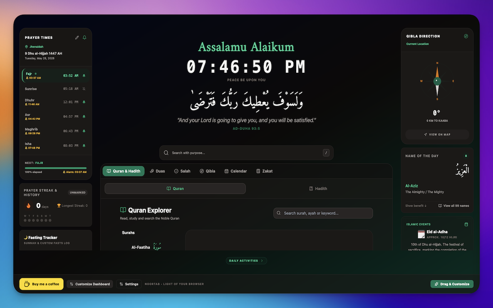
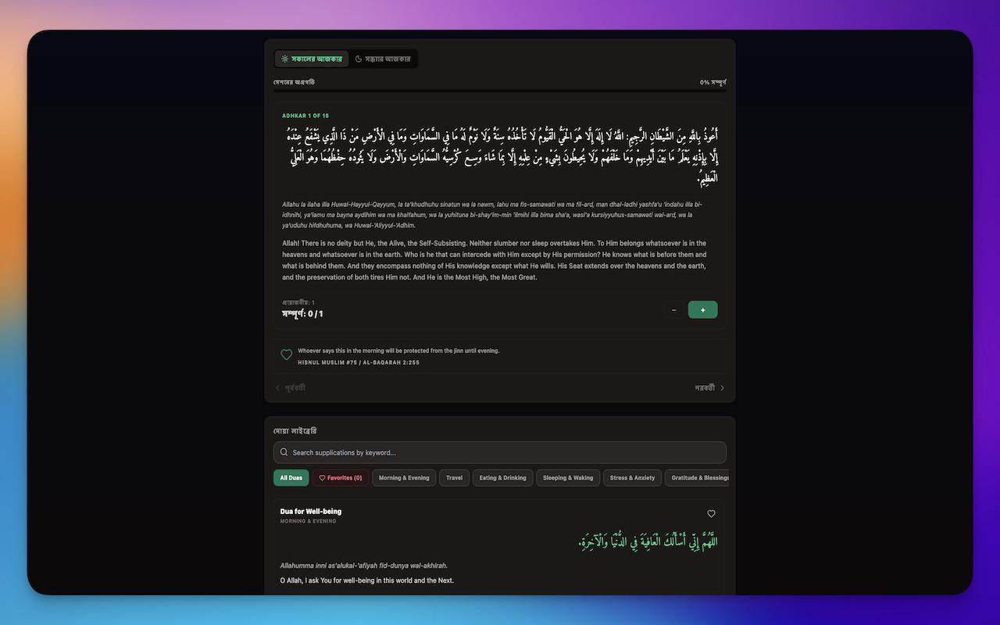
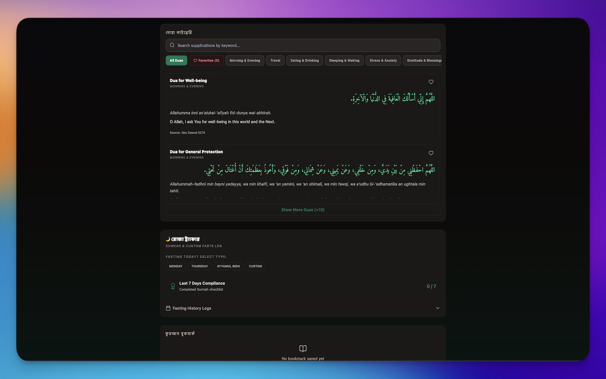
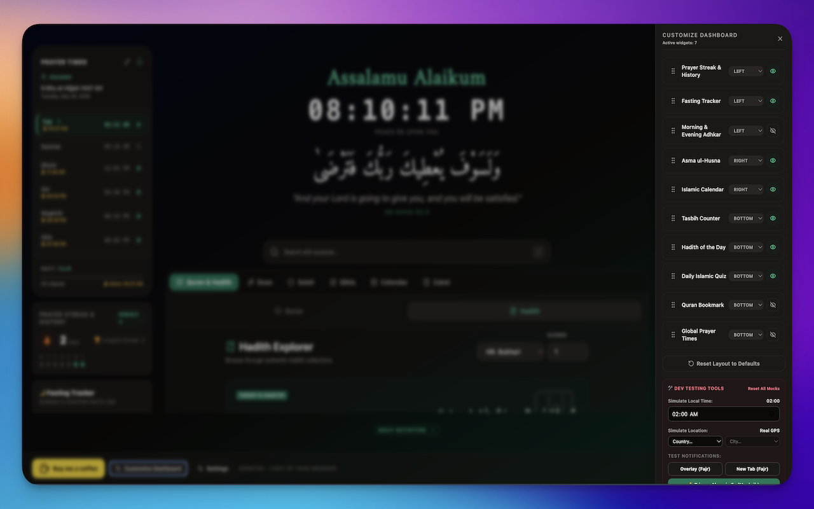
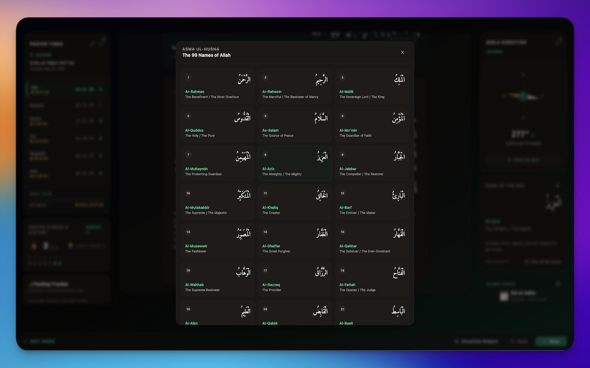

<p align="center">
  
</p>

<p align="center">
  <a href="https://github.com/ratulhasan/noor-tab/releases">
    
  </a>
  <a href="https://www.typescriptlang.org/">
    
  </a>
  <a href="https://plasmo.com/">
    
  </a>
  <a href="https://reactjs.org/">
    
  </a>
  
</p>

<p align="center">
  <strong>NoorTab</strong> transforms every new browser tab into a tranquil Islamic companion - delivering accurate prayer times, Adhan reminders, daily Quranic verses, Hadith, spiritual tools like **How to Pray Salah**, a comprehensive **Dua Library**, and much more, all wrapped in a beautifully designed, distraction-free experience.
</p>

<br/>

---

## ✨ Core Features

<p align="center">
  
</p>
<p align="center">
  
</p>

<p align="center">
  
</p>
<p align="center">
  
</p>
<p align="center">
  
</p>

### 🕌 Prayer Times & Adhan
- **Accurate prayer time calculation** using industry-standard algorithms (Adhan.js) supporting 8+ calculation methods (Muslim World League, ISNA, Egyptian, Umm al-Qura, and more)
- **Madhab support** for Hanafi and standard Asr calculation
- **Per-prayer reminders** - individually enable or disable Fajr, Dhuhr, Asr, Maghrib, and Isha notifications
- **Configurable reminder offset** - be notified 0–30 minutes before each prayer
- **Prayer time adjustment** - manually fine-tune each prayer time by +/- minutes for accuracy
- **Adhan audio playback** - choose from a curated selection of high-quality Adhan recordings; audio plays automatically when the prayer reminder fires
- **Global stop control** - a pulsing mute button appears in the popup header *only while the Adhan is actively playing*, letting you stop it instantly from anywhere
- **Live countdown** to the next prayer with a smooth animated timer
- **Dynamic background gradients** in the new tab that shift throughout the day - dawn blues, midday greens, sunset ambers, and night indigos

### 🤲 Enhanced Dua Library
- **150+ Authenticated Supplications** organized by category.
- **Masnun Duas**: Verified supplications from the Sunnah for daily actions.
- **Quranic Ayats**: Powerful verses from the Noble Quran (e.g., Ayatul Kursi).
- **Useful Surahs**: Key Surahs for daily recitation (e.g., Al-Ikhlas, Al-Falaq, An-Nas, Al-Mulk).
- **Categorized for Life**: Supplications for Morning/Evening, Travel, Stress, Rizq, Health, Forgiveness, and more.

### 🕋 How To Pray Salah
A comprehensive guide to performing the daily ritual prayers:
- **Step-by-Step Instructions**: Visual and textual guide for every action in Salah.
- **Essential Duas & Surahs**: Collection of supplications and verses used within the prayer.
- **Prayer Rakat Table**: Detailed breakdown of Rakat (Sunnah, Fard, Witr, etc.) for all five daily prayers.

### 📅 Islamic Calendar
- **Hijri date** displayed in both English transliteration and Arabic script
- **Islamic event cards** - automatically surfaces upcoming events (Ramadan, Eid, Muharram, Mawlid, etc.) with days-remaining countdown
- **Friday (Jumu'ah) banner** - special contextual greeting every Friday

### 🧭 Qibla Compass
- **Geolocation-aware Qibla direction** calculated from the user's coordinates to Makkah
- Animated SVG compass with degree readout
- Works offline once location is stored

### 📖 Quranic Ayah of the Day
- A beautiful daily Ayah displayed with Arabic text, transliteration, and English translation
- Date-seeded rotation ensures a different verse each day
- Serif typography (`font-amiri`) for a premium Arabic reading experience

### 📚 Hadith of the Day
- Curated authentic Hadith shown daily with source attribution
- Elegant card layout with gradient accents

### 📿 Dhikr Counter
- **Customisable digital counter** for Tasbih, Tahmid, Takbir, and custom Dhikr
- Set personal goals (e.g. 33, 99, 100) with visual progress tracking
- Haptic-style feedback on each count; auto-resets when goal is reached
- Persistent storage - counts survive browser restarts

---

## 🚀 Phase 2 Features

### 📿 Adhkar Player
A full **morning & evening Adhkar companion** built into both the new tab and the popup:
- Structured Adhkar sessions split into Morning and Evening categories
- Each Dhikr item shows its Arabic text, transliteration, translation, and recommended count
- **Progress tracking** - completed items are persisted per day; sessions auto-reset the following morning/evening
- Daily completion percentage with a visual progress bar
- Reminder alarms that fire at Fajr + 30 min (morning) and at Asr time (evening) if enabled in settings

### 🏅 Prayer Streak Tracker
A motivational accountability tool for establishing consistent Salah:
- **7-day streak display** with a visual heatmap of the past week
- Monthly calendar view showing which prayers were prayed, missed, or skipped
- Mark each prayer as **Prayed ✓**, **Missed ✗**, or **Excused (Qada) ◎**
- Current streak counter and longest-ever streak badge
- All data stored locally - 100% private, no account required

### 🌙 Fasting Tracker
Tracks Ramadan and voluntary fasting with full historical logging:
- **Ramadan Mode** - auto-detects the Ramadan month or can be toggled manually
- Mark each day as fasted, not fasted, or excused
- Displays Suhoor and Iftar times based on the user's location (Fajr and Maghrib)
- **Live countdown** to Iftar with seconds precision during a fast
- Monthly fasting calendar with colour-coded status indicators
- Voluntary fast support for Mondays, Thursdays, White Days (13–15 Dhul Hijjah), and the Day of Arafah

### 📖 Quran Bookmark
A lightweight reading-progress companion:
- Save your current Surah and Ayah position
- Browse all 114 Surahs by name, number, and revelation type (Makki / Madani)
- Multiple bookmarks supported - pick up exactly where you left off
- Clean two-panel layout: bookmark list on the left, detail view on the right

### 🔤 Asma ul-Husna - The 99 Names of Allah
- **Name of the Day** card - date-seeded so a different name is highlighted every day
- Displays the Arabic calligraphy, transliteration, English meaning, and a devotional benefit/supplication
- **Smooth animated benefit reveal** - click "Show benefit" to expand the card without layout glitches
- **View all 99 names** opens a full-screen modal (rendered via React Portal to prevent clipping) with a 3-column searchable grid; the today's name is highlighted in emerald

### 🌍 Global Prayer Times
A world-clock-style table showing prayer times for multiple cities simultaneously:
- **Always-on Makkah and Madinah rows** as anchors
- Add up to **3 custom cities** from a searchable dropdown spanning 500+ cities worldwide
- Live prayer time calculations using each city's coordinates and the Umm al-Qura method
- Persistent city selections via storage - survives page refreshes

---

## 💎 Phase 3: Modern Dashboard & Islamic Apps

### 🏗️ 3-Column Modern Dashboard
A sophisticated, responsive layout that organizes your Islamic life:
- **Left Panel**: Fixed area for Prayer Times, Streak tracking, and location info.
- **Center Panel**: Dynamic "Hero" section with daily Ayah, Clock, Purpose Search, and the Quick Access Hub.
- **Right Panel**: Qibla compass and utility widgets like 99 Names and Islamic Calendar.
- **Bottom Activity Bar**: A collapsible "Daily Activities" zone for Dhikr, Quiz, and more.
- **Full Responsive Support**: Seamlessly transitions between 3-column (XL), 2-column (LG/MD), and single-column (SM) views with mobile drawers.

### 🚀 Quick Access Hub
Integrated, full-featured Islamic applications accessible directly within your new tab:
- **📖 Quran & Hadith Explorer**: Combined tab to browse all 114 Surahs and access authentic Hadith collections with search and navigation.
- **🤲 Dua Library**: Searchable collection of 150+ supplications (Masnun, Ayats, and Surahs) for every occasion.
- **🕋 How To Pray Salah**: Full guide with instructions, essential duas, and a rakat table.
- **🧭 Qibla Tab**: A full-sized, animated Qibla compass with distance-to-Kaaba calculation.
- **📅 Islamic Calendar**: A complete monthly Hijri calendar with highlighted Islamic events and holidays.
- **🧮 Zakat Calculator**: Calculate your Zakat obligations with a built-in asset and liability tracker.
- **🧠 Islamic Quiz**: 100 multiple-choice questions across Quran, Fiqh, Seerah, History, and General Knowledge - fully translated in 4 languages.

### 🔍 Purpose Search Bar
A powerful search tool designed for the modern Muslim:
- **Standard Search**: Use Google, DuckDuckGo, Bing, or Ecosia as your default engine.
- **Islamic Prefixes**: Jump directly to specific tabs by typing `quran:`, `hadith:`, or `dua:` followed by your query.
- **Keyboard Shortcut**: Press `/` to focus the search bar instantly.

### 🎨 Drag & Drop Customization
Total control over your dashboard layout:
- **Inter-panel Draggability**: Move widgets between Left, Right, Center, and Bottom panels.
- **Persistence**: Your custom layout is saved automatically and restored on every new tab.
- **Locked Essentials**: Core items like Prayer Times and the Hero section remain anchored for stability.

### 🌙 Glowing "Daily Activities"
The bottom dashboard area now features a subtle emerald glow to gently draw attention to daily spiritual goals like Dhikr and the Islamic Quiz.

### ☕ Jumuah Banner
- Every Friday the new tab displays a special Jumu'ah greeting banner with an emerald accent.
- Subtle background gradient shifts distinguish Friday from other days.

---

## 🔇 Focus Mode (Silence Reminders)
- Moon icon in the popup header opens the **Silence Reminders** dropdown
- Snooze all prayer notifications for **1 hour, 2 hours, or 4 hours**
- Active snooze shows a pulsing indicator and live remaining time countdown
- Background worker respects the snooze window - no alarms fire until it expires
- Disable at any time with the "Disable Focus Mode" option

---

## 💾 Backup & Restore
Export and restore all your personal data in one click:
- Full JSON export covers settings, prayer streak, fasting log, Quran bookmarks, Dhikr goals, Adhkar progress, Dua favourites, quiz records, and widget layout
- Import from any previously exported file with automatic validation
- Enables seamless migration between devices or browsers

---

## 🌐 Multi-Language Support
Full UI localisation for:
| Language | Code | Coverage |
|---|---|---|
| English | `en` | Full UI + Quiz |
| Bengali | `bn` | Full UI + Quiz |
| Arabic | `ar` | Full UI + Quiz |
| Hindi | `hi` | Full UI + Quiz |
| Urdu | `ur` | Full UI + Quiz |

All 100 Islamic Quiz questions are fully translated in Bengali, Arabic, Hindi, and Urdu. Clock, date, and number formatting adapts to the selected locale using native `Intl` APIs.

---

## 📍 Location & Privacy

NoorTab is **entirely local**. There are no accounts, no tracking, and no data is sent to any server.

- Location is detected once via the browser Geolocation API and stored in local extension storage
- Alternatively, choose from 500+ popular cities with a single dropdown or enter coordinates manually
- All streak, fasting, Quran, and quiz data lives in `chrome.storage` (Plasmo Storage) on-device only

---

## 🏗️ Tech Stack

| Layer | Technology |
|---|---|
| Framework | [Plasmo](https://plasmo.com/) (Chrome Extension MV3) |
| UI | React 18 + TypeScript |
| Styling | Tailwind CSS v3 |
| State | `@plasmohq/storage` / `useStorage` hook |
| Prayer Calculation | `adhan` (Adhan.js) |
| Icons | `lucide-react` |
| Build | Parcel (via Plasmo) |
| Testing | - (unit tests planned) |

---

## 📁 Project Structure

```
noor-tab/
├── src/
│   ├── background.ts              # Service worker - alarm scheduling & message routing
│   ├── newtab.tsx                 # New Tab page entry point
│   ├── popup.tsx                  # Browser action popup entry point
│   ├── content.ts                 # Content script for overlay injection
│   │
│   ├── components/
│   │   ├── newtab/
│   │   │   ├── layout/            # 3-Column Dashboard architecture
│   │   │   │   ├── LeftPanel.tsx
│   │   │   │   ├── CenterPanel.tsx
│   │   │   │   ├── RightPanel.tsx
│   │   │   │   ├── HeroSection.tsx
│   │   │   │   └── DragProvider.tsx
│   │   │   ├── hub/               # Islamic Apps Hub
│   │   │   │   ├── QuickAccessHub.tsx
│   │   │   │   └── tabs/          # Quran, Hadith, Zakat, etc.
│   │   │   ├── search/            # Purpose Search implementation
│   │   │   ├── AsmaUlHusna.tsx
│   │   │   ├── GlobalPrayerWidget.tsx
│   │   │   ├── PrayerStreakWidget.tsx
│   │   │   ├── JumuahBanner.tsx
│   │   │   ├── WidgetCustomizer.tsx
│   │   │   ├── AyahDisplay.tsx
│   │   │   ├── HadithOfDay.tsx
│   │   │   ├── DhikrCounter.tsx
│   │   │   └── IslamicCalendar.tsx
│   │   │
│   │   ├── popup/
│   │   │   ├── HijriDate.tsx          # Compact Hijri date badge
│   │   │   ├── NextPrayer.tsx         # Next prayer countdown chip
│   │   │   ├── PrayerList.tsx         # Full prayer list with reminder toggles
│   │   │   ├── QiblaCompass.tsx       # Animated Qibla SVG compass
│   │   │   ├── SettingsPanel.tsx      # All user settings UI
│   │   │   ├── IslamicEventCard.tsx   # Upcoming Islamic event badge
│   │   │   ├── FocusModeToggle.tsx    # Silence reminders dropdown
│   │   │   └── BackupManager.tsx      # Export/import personal data
│   │   │
│   │   └── shared/
│   │       ├── AdhkarPlayer.tsx       # Morning/evening Adhkar session UI
│   │       ├── PrayerStreakTracker.tsx # Full monthly streak calendar
│   │       ├── FastingTracker.tsx     # Ramadan & voluntary fasting log
│   │       ├── QuranBookmark.tsx      # Quran reading progress tracker
│   │       ├── IslamicQuiz.tsx        # Multiple-choice Islamic quiz
│   │       ├── DuaLibrary.tsx         # Searchable dua collection
│   │       ├── AsmaCard.tsx           # Individual Asma name card
│   │       ├── CountdownTimer.tsx     # Reusable countdown display
│   │       └── BuyMeCoffee.tsx        # Support button (badge & floating variants)
│   │
│   ├── services/
│   │   ├── api/                   # Unified API layer with caching
│   │   │   ├── quranApi.ts
│   │   │   ├── hadithApi.ts
│   │   │   └── apiCache.ts
│   │   └── zakat/                 # Zakat calculation logic
│   │
│   ├── hooks/
│   │   ├── useSettings.ts         # Global user settings with Plasmo Storage
│   │   ├── usePrayerTimes.ts      # Prayer time computation hook
│   │   ├── useHijriDate.ts        # Hijri date formatting hook
│   │   ├── useQibla.ts            # Device orientation & Qibla hook
│   │   ├── useLayoutState.ts      # Dashboard widget layout state
│   │   └── useCountdown.ts        # Reusable countdown timer logic
│   │
│   ├── utils/
│   │   ├── prayerCalculator.ts    # Adhan.js wrapper for prayer time calc
│   │   ├── alarmScheduler.ts      # Chrome alarm creation & management
│   │   ├── locationService.ts     # Geolocation & geocoding helpers
│   │   ├── streakCalculator.ts    # Prayer streak logic
│   │   ├── fastingHelper.ts       # Ramadan detection & fasting utils
│   │   ├── jumuahHelper.ts        # Friday detection helper
│   │   ├── dateUtils.ts           # Native JS date helpers (format, subDays, etc.)
│   │   ├── backupManager.ts       # JSON export/import logic
│   │   └── cn.ts                  # Tailwind class merge utility
│   │
│   ├── data/
│   │   ├── adhanAudios.ts         # Adhan audio option registry
│   │   ├── adhkar.ts              # Morning & evening Adhkar content
│   │   ├── asmaUlHusna.ts         # All 99 names with meanings & benefits
│   │   ├── ayahs.ts               # Daily Ayah dataset
│   │   ├── ayats.ts               # Quranic Ayats for Dua Library
│   │   ├── defaultSettings.ts     # Default UserSettings shape
│   │   ├── duas.ts                # Categorised supplications
│   │   ├── hadiths.ts             # Daily Hadith dataset
│   │   ├── hubTabs.ts             # Quick Access Hub tab definitions
│   │   ├── islamicEvents.ts       # Upcoming Islamic events dataset
│   │   ├── masnun.ts              # Masnun Duas for Dua Library
│   │   ├── popularLocations.ts    # 500+ cities with coordinates
│   │   ├── prayerNames.ts         # Prayer metadata (Arabic, transliteration)
│   │   ├── quizQuestions.ts       # 100 Islamic quiz questions (English)
│   │   ├── quizTranslations.ts    # Bengali translations for all quiz questions
│   │   ├── quizTranslationsAr.ts  # Arabic translations for all quiz questions
│   │   ├── quizTranslationsHi.ts  # Hindi translations for all quiz questions
│   │   ├── quizTranslationsUr.ts  # Urdu translations for all quiz questions
│   │   ├── surahs.ts              # Useful Surahs for Dua Library
│   │   └── translations.ts        # UI strings in 5 languages
│   │
│   └── types/
│       └── index.ts               # All shared TypeScript types & interfaces
│
├── assets/
│   └── banner.png                 # README banner image
├── package.json
├── tailwind.config.js
└── tsconfig.json
```

---

## 🛠️ Development

### Prerequisites
- Node.js ≥ 18
- npm ≥ 9

### Getting Started

```bash
# Clone the repository
git clone https://github.com/ratulhasan/noor-tab.git
cd noor-tab

# Install dependencies
npm install

# Start the development server (hot-reload)
npm run dev
```

### Loading the Extension in Chrome

1. Open Chrome and navigate to `chrome://extensions`
2. Enable **Developer Mode** (top-right toggle)
3. Click **Load Unpacked**
4. Select the `build/chrome-mv3-dev` folder generated by `npm run dev`

### Production Build

```bash
npm run build
```

The production bundle is output to `build/chrome-mv3-prod/`.

### 🛠️ Developer Mode & Testing Tools

NoorTab includes a built-in suite of Developer Testing Tools, which are consolidated in the **Widget Customizer** sidebar (New Tab page) when built in dev mode:
- **Enable Developer Mode**: Build or start the extension with the environment variable `PLASMO_PUBLIC_DEV_MODE=true` set in the environment or `.env` file.
- **Local Time Simulator**: Speed up testing by simulating any hour/minute of the day. The tab's dynamic background gradient transitions and clock adjust instantly.
- **Global Location Simulator**: Select any country and city from a dropdown to simulate different geographic locations. The prayer times and timezone offset recalculate instantly.
- **Immediate Notifications Tester**: Fire mock prayer alarms (Maghrib), center-modal overlays (Fajr), or new tab notifications instantly to test the notification triggers.

---

## ⚙️ Settings Reference

| Setting | Options | Description |
|---|---|---|
| Calculation Method | 8 methods | Prayer time calculation school |
| Madhab | Hanafi / Standard | Asr time calculation preference |
| Reminder Offset | 0–30 min | How early before the prayer to notify |
| Per-Prayer Reminders | Toggle per salah | Enable/disable individual prayer alarms |
| Adhan Audio | None + 6 reciters | Audio to play when prayer reminder fires |
| Notification Style | New Tab / Overlay / Both | How prayer reminders are displayed |
| Language | en / bn / ar / hi / ur | Full UI language |
| Morning Adhkar Reminder | On/Off | Alarm at Fajr + 30 min |
| Evening Adhkar Reminder | On/Off | Alarm at Asr time |

---

## 🤝 Contributing

Contributions, bug reports, and suggestions are very welcome!

1. Fork the repository
2. Create a feature branch: `git checkout -b feat/my-feature`
3. Commit with conventional commits: `git commit -m "feat: add XYZ"`
4. Push and open a Pull Request

Please ensure your PR includes:
- A clear description of what changed and why
- Screenshots for any UI changes
- No `console.log`, `dd()`, or commented-out code

---

## 📄 License

MIT © [Ratul Hasan](https://github.com/ratulhasan)

---

<p align="center">
  Built with 💚 for the global Muslim community.<br/>
  <em>May Allah accept this effort and make it a source of benefit.</em>
  <br/><br/>
  <a href="https://www.buymeacoffee.com/ratulhasan">
    
  </a>
</p>
