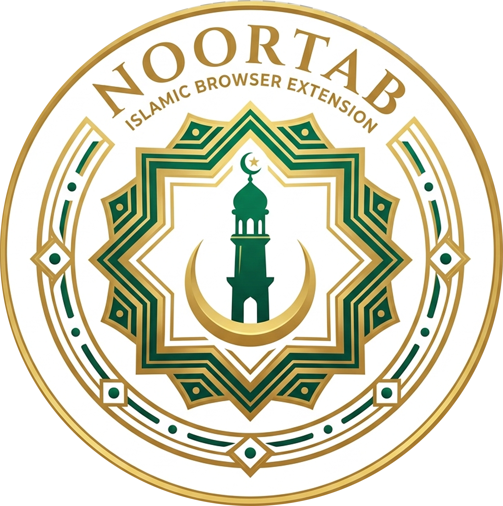

# Privacy Policy

# NoorTab - Privacy Policy

**Your privacy is not just a policy - it is a principle.**

*Last updated: May 2026*
*Effective date: May 2026*

---

## Overview

NoorTab is an Islamic prayer companion browser extension built for the Muslim Ummah. It was designed from the ground up with a single, unwavering commitment: **your data belongs to you, stays with you, and never leaves your device.**

There are no accounts. No servers. No tracking. No analytics. No advertisements. Nothing is collected. Nothing is transmitted. Nothing is sold.

This document explains, in plain language, exactly what NoorTab does and does not do with your information.

---

## 1. Information We Do Not Collect

NoorTab does **not** collect, store on any server, transmit, share, or sell any of the following:

| Data Type | Collected? |
|---|---|
| Name, email address, or any personal identifier | ❌ Never |
| Browsing history or visited URLs | ❌ Never |
| Clicks, keystrokes, or user activity | ❌ Never |
| Device identifiers or IP addresses | ❌ Never |
| Financial or payment information | ❌ Never |
| Health or biometric information | ❌ Never |
| Passwords or authentication credentials | ❌ Never |
| Personal communications | ❌ Never |
| Website content from pages you visit | ❌ Never |

---

## 2. Information Stored Locally on Your Device

NoorTab stores the following data **exclusively in your browser's local extension storage** (`chrome.storage.local`). This data never leaves your device and is never accessible to us or any third party.

### 2.1 Location Coordinates

- **What:** Latitude and longitude coordinates used to calculate accurate prayer times.
- **How obtained:** Either via the browser's built-in Geolocation API (only when you explicitly click "Auto-detect location") or manually entered by you as a city and country name, which is resolved to coordinates via a one-time request to OpenStreetMap's Nominatim API - a free, open-source geocoding service.
- **Where stored:** Only in `chrome.storage.local` on your device.
- **Transmitted?** No. After the initial coordinate resolution, all prayer time calculations happen entirely on your device.

### 2.2 Prayer Settings & Preferences

- Calculation method (e.g. Muslim World League, ISNA, Umm al-Qura)
- Madhab selection (Shafi / Hanafi)
- Per-prayer reminder toggles and offset minutes
- Notification style preference
- Theme, language, and widget layout configuration
- Adhan reciter selection and audio preferences

### 2.3 Devotional & Worship Data

- **Prayer streak records:** Daily logs of prayers marked as on time, late, or missed
- **Fasting records:** Ramadan and Sunnah fast completion logs
- **Quran bookmark:** Your current Surah and Ayah reading position and notes
- **Dhikr counter:** Session and goal progress
- **Adhkar progress:** Daily morning and evening session completion state
- **Islamic quiz records:** Daily answers and lifetime score

All of the above is personal worship data that you create. It is stored locally, belongs entirely to you, and can be exported and deleted at any time.

---

## 3. Third-Party Services

NoorTab uses **no third-party analytics, advertising networks, or tracking services** of any kind.

The only external network request NoorTab may make is a **one-time geocoding lookup** when you choose to search for your city by name:

| Service | Purpose | Data sent | Privacy policy |
|---|---|---|---|
| [OpenStreetMap Nominatim](https://nominatim.openstreetmap.org) | Resolve city name to coordinates | City name + country string only | [OSM Privacy Policy](https://wiki.osmfoundation.org/wiki/Privacy_Policy) |

This request contains no personal identifiers. After your coordinates are resolved and saved locally, no further external requests are made for prayer time calculations - the `adhan-js` library performs all calculations on-device.

---

## 4. Permissions Explained

NoorTab requests the following browser permissions. Each is used exclusively for the feature described:

| Permission | Why it is needed |
|---|---|
| `storage` | Saves all your settings, prayer records, and preferences locally in `chrome.storage.local` on your device |
| `alarms` | Schedules prayer reminder notifications at the correct time for each of the five daily prayers, and resets daily session data at midnight |
| `tabs` | Opens the NoorTab new tab reminder page when a prayer time arrives, if you have chosen that notification style |
| `activeTab` | Injects the prayer reminder overlay into your current tab when a prayer reminder fires, if you have chosen the overlay notification style |
| `scripting` | Executes the geolocation detection script inside your active tab (required in Manifest V3 since popups cannot access the Geolocation API directly) and injects the reminder overlay |
| `<all_urls>` (host permission) | Required because prayer reminders are time-based and fire regardless of which website you are visiting - the extension cannot know your current tab's URL in advance. No page content is read or stored |

---

## 5. Data You Export & Import

NoorTab includes a **Backup & Restore** feature that allows you to export all your local data as a `.json` file and import it on another device or browser.

- Exported files are downloaded directly to your device.
- They are never uploaded to any server by NoorTab.
- The contents of exported files are your own data, under your own control.
- NoorTab does not have access to files you export or import.

---

## 6. Children's Privacy

NoorTab does not knowingly collect any information from anyone, including children under the age of 13. Since NoorTab collects no personal information whatsoever, it is safe for users of all ages.

---

## 7. Changes to This Policy

If this privacy policy is ever updated, the updated version will be published in this repository with a revised "Last updated" date at the top of this document. Since NoorTab collects no data, any future changes would only reflect new features or clarifications - not new data practices.

You can track all changes to this file in the [commit history](https://github.com/RatulHasan/noor-tab/commits/main/PRIVACY.md).

---

## 8. Open Source

NoorTab's source code is open and auditable. You do not need to take our word for any of the privacy claims in this document - you can verify them directly in the code.

🔗 [github.com/RatulHasan/noor-tab](https://github.com/RatulHasan/noor-tab)

---

## 9. Contact

If you have any questions about this privacy policy or NoorTab's data practices, please open an issue in the GitHub repository:

🔗 [github.com/RatulHasan/noor-tab/issues](https://github.com/RatulHasan/noor-tab/issues)

---

**NoorTab collects nothing. Tracks nothing. Sells nothing.**

*Made with 🤍 for the Muslim Ummah*

*"And He is with you wherever you are." - Quran 57:4*

